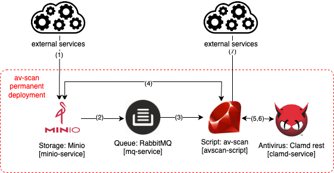

## bucket-av-scanner

### Table of contents
- [Abstract](#abstract)
- [Main folder structure](#main-folder-structure)
- [Tools and libraries](#tools-and-libraries)
- [Architecture diagram](#architecture-diagram)
- [Assumptions, requirements and considerations](#assumptions--requirements-and-considerations)
- [Deployment pipeline and testing with make file](#deployment-pipeline-and-testing-with-make-file)
- [Configuration parameters](#configuration-parameters)
- [Paths](#paths)
- [Networking](#networking)
- [Technical decisions](#technical-decisions)
- [Security and best practices](#security-and-best-practices)
- [Known issues](#known-issues)
- [Moving to production and possible upgrades](#moving-to-production-and-possible-upgrades)
- [Useful links](#useful-links)
- [Possible alternatives](#possible-alternatives)

### Abstract
  This document tries to explain the application workflow, set up and configuration of bucket-av-scanner. The solution is automating the new files scan by using bucket event notifications, a ruby script and clamd.
  - Scalability is handled by decoupling the notifications and the scanning script though a RabbitMQ queue.
  - Storage is implemented in MinIO buckets.
  - ClamD scanning is managed in a REST API.
  - The entire solution is running on standard public containers images.
  - The workflow is managed by a Makefile.
  - Containers deploy is implemented on a docker-compose yml manifest.
  - Set up is done by custom entrypoints scripts.
  - HA and resiliency is ensured by healthchecks and volumes.
  - The entire solution is using open source tools.

### Main folder structure
Files and scripts has been distributed as follows:
```
├── Makefile                _# Makefile defining the workflow deploying, testing, and wrapping up the application_
├── README.rd               _# project documentation_
├── bucket-av-scanner.png   _# main architecture diagram used in README.rd_
├── docker-compose          _# folder containing docker-compose manifest and custom entrypoint scripts_
    ├── docker-compose.yml                                _# main docker-compose manifest defining services_
    ├── docker-compose_avscan-script_entrypoint.sh        _# custom entrypoints script for avscan-script service_
    ├── docker-compose_minio-service-init_entrypoint.sh   _# custom entrypoints script for minio-service initialization_
    ├── docker-compose_minio-service_entrypoint.sh        _# custom entrypoints script for minio-service service_
    └── docker-compose_mq-service-init_entrypoint.sh      _# custom entrypoints script for mq-service service_
└── testing             _# folder containing testing scripts_
    └── bucket-av-scanner_tests.sh   _# testing script with clean and infected (EICAR) cases_
```

### Tools and libraries
The following tools has been used:
- av-scan script
  - ruby [3.0.2p107]        _# running main script_
  - ruby gems
    - aws-sdk-s3 [1.114.0] _# download newly putted file on MinIO_
    - json [2.6.2]         _# post scan notification formating_
    - uri [0.11.0]         _# request and notification fields management_
    - yaml [0.2.0]         _# request and notification fields management_
    - logger [1.5.1]       _# script messages logging_
    - securerandom [0.2.0] _# randomize filename locally on avscan container before scanning_
    - bunny [2.19.0]       _# mq queue subscribing and management_
    - net [0.3.3]          _# request and notification network comunication_
    - rest-client [2.1.0]  _# clamd post request_
- Queue management
  - RabbitMQ [3.8.34]     _# MQ queue implementation_
- Bucket storage solution
  - MinIO [2022-05-26T05:48:41Z] _# bucket implementation_
- Antivirus solution
  - ClamAV 0.104.3
- Deploy
  - docker [20.10.12]       _# running standard docker images_
  - docker-compose [1.29.2] _# defining and creating docker services_
- Testing
  - aws cli [2.7.30] _# uploading and listing files_
  - wget [1.21.3]    _# downloading EICAR signature file_

- Docker container images

  | image name          | tag                          | size                         | usage                        |
  |---------------------|------------------------------|------------------------------|------------------------------|
  | ajilaag/clamav-rest | latest                       | 263MB                        | antivirus scanning           |
  | rabbitmq            | 3.8-management-alpine        | 148MB                        | mq queue                     |
  | minio/minio         | RELEASE.2022-05-26T05-48-41Z | 376MB                        | bucket storage               |
  | minio/mc            | RELEASE.2022-05-09T04-08-26Z | 158MB                        | bucket initialization        |
  | alpine/openssl      | latest                       | 8.04MB                       | tls ssl generation           |
  | ruby                | 2.7.0                        | 842MB                        | av-scan sscript execution    |

### Architecture diagram
Execution workflow steps are as follows



1) An external service uploads a file on the MinIO s3 bucket
2) MinIO sends a PUT notification to the RabbitMQ queue
3) The notification is read by the internal ruby script subscribed to the queue
4) The internal ruby script downloads temporally the file from MinIO s3 bucket
5) The internal ruby script scans the file by sending it to clamd-service
6) using ClamAV and sends the response back to avscan-script
7) The internal ruby script notifies the content sharing service endpoint with the results (event if it's infected or not)

The following 3 services, are used only for iniitalize proposes, and are running only on deploy time
- mq-service-init: initializing mq-service queue, tags, users and bindings
- minio-service-init: creating buckets and users on minio-service
- openssl-init: generating self-signed certificate for minio-service

### Assumptions, requirements and considerations
Running the Makefile assumes:
- aws cli installed and PATH accessible.
- docker daemon is running.
- docker-compose installed and PATH accessible.
- you have access to internet (DockerHub and Gem sources) for downloading public images and gem libraries.
- other tools like make and wget installed and PATH accessible.


### Deployment pipeline and testing with make file
The following stages has been defined on the [Makefile](Makefile)
- **make all** _(< 15m)_
  runs sequentially all the workflow: "make deploy-docker", "make test" and "make deploy-docker"
- **make deploy-docker** _(< 11m)_
  creation of all the needed resources on local docker daemon
- **make test** _(< 10s)_
  runs sequentially tests by uploading a clean and infected files
- **make clean-docker** _(< 5m)_
  deletes the docker-compose resources created during the deploy
- **wait-deploy-docker** _(< 11m)_
  dirty workaround (sleep) waiting deploy-docker, as "ready heathcheck" has not been implemented yet for avscan-script, docker-deploy is done as "detached" mode, and gem installation takes time (around 11 minutes)

### Configuration parameters
Most important configuration parameters are customizable as follows:

- **MINIO_ROOT_USER**: admin user name for "minio-service" service. Default: _minioadmin_
- **MINIO_ROOT_PASSWORD**: admin user password for "minio-service" service.
- **MINIO_SERVER_URL**: service name and port for accessing "minio-service" service. Default: _https://minio-service:9000_
- **MINIO_USER_NAME**: regular user name for "minio-service" service. Default: _miniouser_
- **MINIO_USER_PASSWORD**: regular user password for "minio-service" service.
- **MINIO_BUCKET_NAME**: bucket name created on "minio-service" service. Default: _storagebucket_
- **MQ_ENDPOINT**: service name for accessing "minio-service" service. Default: _mq-service_
- **MQ_PORT=**: service port number for accessing "minio-service" service. Default: _15672_
- **RABBITMQ_DEFAULT_USER**: admin user name for "rabbitmq-service" service. Default: _rabbitadmin_
- **RABBITMQ_DEFAULT_PASS**: admin user password for "rabbitmq-service" service.
- **RABBITMQ_REGULAR_USER_NAME**: regular user password for "minio-service" service. Default: _rabbituser_
- **RABBITMQ_REGULAR_USER_PASS**: regular user password for "minio-service" service.
- **RABBITMQ_QUEUE_ROUTING_KEY**: MQ routing key for directing MinIO notification to mq queue. Default: _bucket_notifications_
- **MQ_QUEUE_NAME**: MQ routing key for directing MinIO notification to mq queue. Default: _s3minioqueue_
- **MQ_TOPIC**: MQ topic created where MinIO notification are redirected to. Default: _s3minioscan_
- **TAG_FILES**: option enabling adding tag to scanned files on the bucket. Default: _true_
- **TAG_KEY**: Tag added to scanned files if TAG_FILES is true: Default: _scanned_
- **REPORT_CLEAN**: option enabling sending of not resulting scan execution. Default: _false_
- **PUBLISH_ENDPOINT**: option setting up the endpoint where to send the result of scanning execution. Default: _https://some-service.example.com/notification_

### Paths
Paths and folders inside the different services has been distributed as follows:

| service name     | path                         | usage                     |
|------------------|------------------------------|---------------------------|
| minio-service    | /root/.minio/certs           | certificates              |
| minio-service    | /data/<bucket_name>          | bucket data               |
| minio-service    | /data/.minio.sys             | config files              |
| rabbitmq-service | /var/log/rabbitmq            | rabbitmq service log      |
| rabbitmq-service | /var/lib/rabbitmq            | rabbitmq service queue    |
| avscan-script    | /opt/av-scan/worker.rb       | avscan ruby script        |
| avscan-script    | /opt/av-scan/av-scan.conf    | avscan configuration file |
| avscan-script    | /opt/av-scan/av-scan.log     | avscan log                |
| clamd-service    | /var/lib/clamav/             | clamd virus definitions   |
| clamd-service    | /usr/bin/entrypoint.sh       | entrypoint scripts        |
| clamd-service    | /etc/clamav/clamd.conf       | clamd configuration file  |
| clamd-service    | /var/log/clamav/clamd.log    | clamd daemon log          |

### Networking
The following ports and paths are accessible on the deploy:

| service name  | port and path | protocol | usage                                         |
|---------------|---------------|----------|-----------------------------------------------|
| minio-service | 3310/         | tcp      | ClamD Listening Port                          |
| clamd-service | 9443/scan     | https    | ClamD HTTP scan                               |
| clamd-service | 9443/metrics  | https    | ClamD Prometheus metrics                      |
| minio-service | 9001/         | https    | MinIO Web Console                             |
| minio-service | 9000/         | ssl      | MinIO bucket service                          |
| mq-service    | 15672/        | tcp/http | RabbitMQ queue subscription and web interface |

### Technical decisions
The following decisions has been considered done during the implementation:
  - all custom logging messages starting with [SERVICE_NAME] for a clear understanding
  - using official aws s3 client: instead of using MinIO client for uploading/downloading files into the bucket, as same AWS API is implemented and also using basic funcionality.
  - Docker images
    - pinned versions avoiding missconfigurations for features deprecation.
    - using "rabbitmq management-alpine" image instead of regular "rabbitmq" image: rabbitmq_management necessary plugin is enabled by default on management docker images, cannot be enabled by env vars and there is minimal size and software diferences, rabbitmq_management plugin is enabled by default ()
    - using "ruby" regular image instead of "ruby-slim": additional libraries are needed, and it's installation extend the installation boot first boot even more.
  - Docker volumes for data and logging:
    - keeping state and container configuration after failure restarts
    - making it accessible and visible for future additional components (logging sidecar)
    - mount binding for entrypoint, avoiding new volumes creation
  - Custom entrypoints
    - using dynamic "until ... do" loops instead of hardcoded sleep commands, avoiding raise conditions on boot dependencies
    - using info/error logging levels as possible, avoiding unnecessary information and getting faster boot
    - using separate entrypoint script files, for a better easier debug and understanding
  - Architecture
    - getting file upload scalability, due multiple avscan script and clamd containers can be deployed subscribed to the same MQ queue
    - why not changing the workflow making the uploading file service scan it first to clamd before storing it into s3 bucket? Im assuming as a requirements:
      - to don't modify the legacy application workflow
      - Same working MinIO bucket/cluster could be needed to keep
      - solution does not scale if you dont decouple the notification-script-scan by a queue

### Security and best practices
- In transit encrypted traffic by using SSL certificates on minio-service (port 9000) and clamd SSL (9443)
- no using admin neither default users, minio, and creating regular non-priviledged users (miniouser, rabbituser) non-priviledge uses
- exposing minimal necessary ports (no plain http protocols), reducing attach surface
- exposing only necessary credentials and vars on each container (non admin users)
- random filename usage inside avscan-script (securerandom gem), and ensuring its deleted after every scan
- virus definition files are updated by clamd-service

### Known issues
- dependencies between services/containers are not properly managed on docker-compose. As a workaround, the entrypoint script is holding the execution until the needed service/endpoint is ready
- initialization time for avscan-script service (around 11 minutes). Installing needed gem dependencies for ruby script takes time during initial boot. I would like to keep using public docker images and dynamic initialization script (entrypoint) for better solution understanding. As a workaround, a custom Docker image could be generated and used with the gem dependencies already installed.
- self-signed certificates. Due for infra limitations, certificates generated on deploy with openssl time are self-signed. Even this ensures in-transit encrypted comunication, certificates itself are not accepted as hey are not using a valid CA/DNS domain. As a workaround, ssl verify has been disabled on [aws s3 sdk](https://docs.aws.amazon.com/cli/latest/reference/s3api/get-object.html) and also on chrome.

### Moving to production and possible upgrades
- Ruby Script
  - better [error and exception management](https://www.rubyguides.com/2019/06/ruby-rescue-exceptions/) in avscan-script ruby script, splitting by error type, and logging and error code number
  - [read vars from OS](https://www.rubyguides.com/2019/01/ruby-environment-variables/) (docker image) on avscan-script, avoiding configuration file
- Logging management
  - forward local containers logs by using sidecar strategy and [Loki/Prometheus/Splunk agent](https://docs.docker.com/config/daemon/prometheus/)
- Security
  - encrypted MQ communication by adding ssl certificated on rabbitmq as well [RABBITMQ_SSL_CERTFILE, RABBITMQ_SSL_KEYFILE](https://hub.docker.com/_/rabbitmq)
  - [import self signed certificates into local container cert database](https://www.gnupg.org/documentation/manuals/gnupg/Certificate-Management.html) for all containers, avoiding SSL check disable on aws cli
  - using [docker secrets](https://docs.docker.com/engine/swarm/secrets/#use-secrets-in-compose) to store credentials
  - generating random passwords on deploy time and in each deploy by /dev/random
- Storage
  - Scaling storage solution by deploying a [MinIO Tenant/Cluster](https://docs.min.io/minio/k8s/tenant-management/manage-minio-tenant.html) sharing same bucket volume
- Deployment/architecture  
  - using [separate files env_file](https://docs.docker.com/compose/environment-variables/#the-env_file-configuration-option) for environment vars in docker-compose
  - "make status" entry checking service availability and endpoints connectivity
  - "ready" service endpoint on "avscan-script" service for healthcheck and no "sleep" hardcoded times deploy
  - offline clamd update (virus definition sidecar strategy on /var/lib/clamav/), getting and entire offline solution
  - upgrade used software versions (ruby, RabbitMQ, MinIO, etc...)
- Kubernetes (future)
  - migrate docker compose file, and using [Horizontal Pod Autoscaling (hpa)](https://kubernetes.io/docs/tasks/run-application/horizontal-pod-autoscale/) for autoscaling "avscan-script" and "clamd-service" services, based on queue/clamd CPU performance
  - create [ingress for each service](https://kubernetes.io/docs/concepts/services-networking/ingress/#what-is-ingress) and switch ssl management to a tls secret
  - persistent MinIO data volume by using [Container Storage Interface (CSI)](https://kubernetes.io/blog/2019/01/15/container-storage-interface-ga)

### Useful links
- minio-service
  - [MinIO Admin Complete Guide](https://docs.min.io/docs/minio-admin-complete-guide.html)
  - [MinIO How to secure access to MinIO server with TLS](https://nm-muzi.com/docs/how-to-secure-access-to-minio-server-with-tls.html)
  - [MinIO How to use AWS SDK for Ruby with MinIO Server](https://docs.min.io/docs/how-to-use-aws-sdk-for-ruby-with-minio-server.html)
- rabbitmq-service
  - [RabbitMQ Management Command Line Tool](https://www.rabbitmq.com/management-cli.html)
  - [RabbitMQ Routing](https://www.rabbitmq.com/tutorials/tutorial-one-ruby.html)
  - [RabbitMQ Management HTTP API](https://rawcdn.githack.com/rabbitmq/rabbitmq-server/v3.10.7/deps/rabbitmq_management/priv/www/api/index.html)
- avscan-script
  - [rabbitmq
    /
    rabbitmq-tutorials](https://github.com/rabbitmq/rabbitmq-tutorials/blob/master/ruby/receive.rb)
  - [Ruby Module: RestClient](https://www.rubydoc.info/gems/rest-client/2.1.0/RestClient)
- clamd-service
  - [ajilach
    /
    clamav-rest
    Public](https://github.com/ajilach/clamav-rest)
  - [EICAR Anti-malware testfile](https://www.eicar.org/download-anti-malware-testfile)
- aws s3
  - [aws/s3api/get-object](https://docs.aws.amazon.com/cli/latest/reference/s3api/get-object.html)
  - [aws/Class: Aws::S3::Client](https://docs.aws.amazon.com/sdk-for-ruby/v3/api/Aws/S3/Client.html)

### Possible alternatives

- [ifad
  /
  clammit
  ](https://github.com/ifad/clammit) : discarted option due modifies the legacy application workflow, and also needs the additional clamd service/docker
- [widdix
  /
  aws-s3-virusscan](https://github.com/widdix/aws-s3-virusscan) : discarted option due is not cloud-agnostic, open source
- [awslabs
  /
  cdk-serverless-clamscan](https://github.com/awslabs/cdk-serverless-clamscan) : discarted option due is not cloud-agnostic, open source
